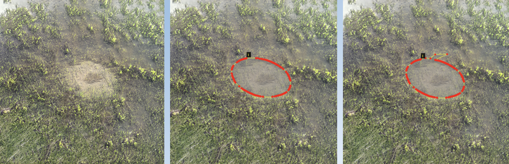

# Image Annotation through Semi-Automatic Convex Hull Detection

Annotate anything with semi-automatic image annotation through convex hull detection.

Image annotation can be a tedious task, especially when dealing with intricate details. With this semi-automatic approach using convex hull detection, we aim to simplify the annotation process, ensuring accurate and quick results. By leveraging the power of Convex Hull algorithms and deep learning, this repository provides a solution to extract and annotate objects in images.


## Sample Images:

Below are some example images that have been processed with the semi-automatic image annotation through convex hull detection:




## Features:
- **Automatic Model Loading**: Seamlessly load a pre-trained model for predictions.
- **Batch Image Processing**: Process a directory of images to predict masks efficiently.
- **Convex Hull Extraction**: Extract and visualize convex hulls from the predicted masks.
- **JSON Output**: Conveniently save the convex hull coordinates to a JSON file for further applications or review.
- **Customizable**: Easily adaptable code to fit different model architectures or directory structures.

## Table of Contents:

1. [Installation](#installation)
2. [Usage](#usage)
3. [Directory Structure](#directory-structure)
4. [Procedures](#procedures)
5. [Acknowledgments](#acknowledgments)

## Installation:

To start using this tool, you will need to clone this repository to your local machine.

```bash
git clone https://github.com/padam56/Convex_Hull_Annotator.git
cd Convex_Hull_Annotator
```

## Usage:

### Setup
Ensure you have all the required dependencies installed.

### Directory Structure
Organize your files according to the recommended directory structure.

### Execute
Run the script to process and annotate your images:

```bash
python convex_hull.py
```

After processing, convex hull results for each image will be saved in the designated output directory, and all convex hull coordinates will be stored in a JSON file.


## Directory Structure:

project-name/  
│  
├── convex_hull.py  
│  
├── datasets/  
│   └── images/  # Directory containing the new images  
│       ├── image1.jpg  
│       ├── image2.jpg  
│       └── ...  
│  
├── output_images/  # Directory to save output images  
│   ├── annotated_images/  
│   │   ├── image1_annotated.jpg  
│   │   ├── image2_annotated.jpg  
│   │   └── ...  
│   │  
│   └── convex_hull_data.json  
│  
└── models/  
    └── model-name/  
        └── model_file.h5  # Pre-trained model file  

## Procedures:

### Step 1: Initial Hand Labeling

1. **Start Small**: Begin with a subset of your data. For instance, 100 images.
2. **Preliminary Model Training**: Train an initial segmentation model on these hand-labeled images to recognize and segment objects, producing a rough segmentation.

### Step 2: Automatic Convex Hull Detection

1. **Rough Segmentation**: Utilize the preliminary model to produce segmentations on a larger dataset.
2. **Convex Hull Application**: Form boundaries around these segmentations using the convex hull technique.
3. **Export to JSON**: Save the convex hull coordinates. This output is compatible with the VGG image annotator for further annotation tasks.

### Step 3: Manual Adjustment with Bezier Curves

1. **Manual Refinement**: Adjust the convex hulls, if needed, using Bezier curves for more intricate boundaries.
2. **Retraining and Enhancement**: Re-train your model with this refined data, iteratively enhancing its performance.
3. **Progressive Improvement**: As more images are annotated and corrected, the model's accuracy and efficiency improve.

## Benefits:

- **Speed**: Achieve quicker rough segmentation compared to fully manual methods.
- **Accuracy**: Ensure high precision with our further refinement techniques.
- **Scalability**: Designed to adapt to projects of various scales.
- **Cost-Efficient**: Significant reduction in time and labor costs due to semi-automatic processes.


## Acknowledgments:
If this code or model is part of a larger research project or is based on a specific paper, be sure to reference it here.
